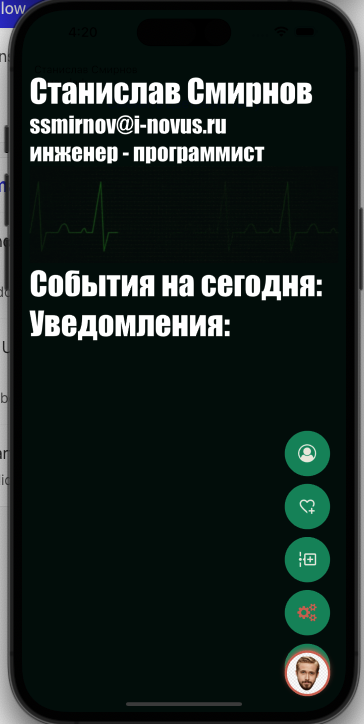

<--- О ПРИЛОЖЕНИИ --->
React Native приложение для новых сотрудников.
Планируется отображение статистики, событий и этапов сотрудника, элементы геймификации.
Авторизация происходит через Inportal с помощью RN Webview с инъекцией js кода для получения сессионной куки
Для удобства использования одной рукой вся навигация в приложении реализована нажатием одной кнопки (она же аватар юзера), нажатие вызывает анимацию  с фоном с данными по юзеру и всплывающим вертикальным меню:

<--- УСТАНОВКА И ЗАПУСК --->
Для установки APK файл собираться в корне проекта в папке build
Для запуска и тестирования не обязательно устанавливать приложение, оно использует сборщик expo (https://expo.dev/)
Запуск на устройстве (ios или android):
1) Через апстор или гугл плей установить приложение expo go
2) На айфон через камеру просканировать QR код (который генерируется при запуске приложения в терминале), на андройд код надо просканировать в самом приложении

(если кон не читается камерой в таком формате, то можно скопировать его и вставить в терминал или какой нибудь текстовый редактор.ИДЕ)
3) expo автоматически соберет проект на устройстве и запустит
